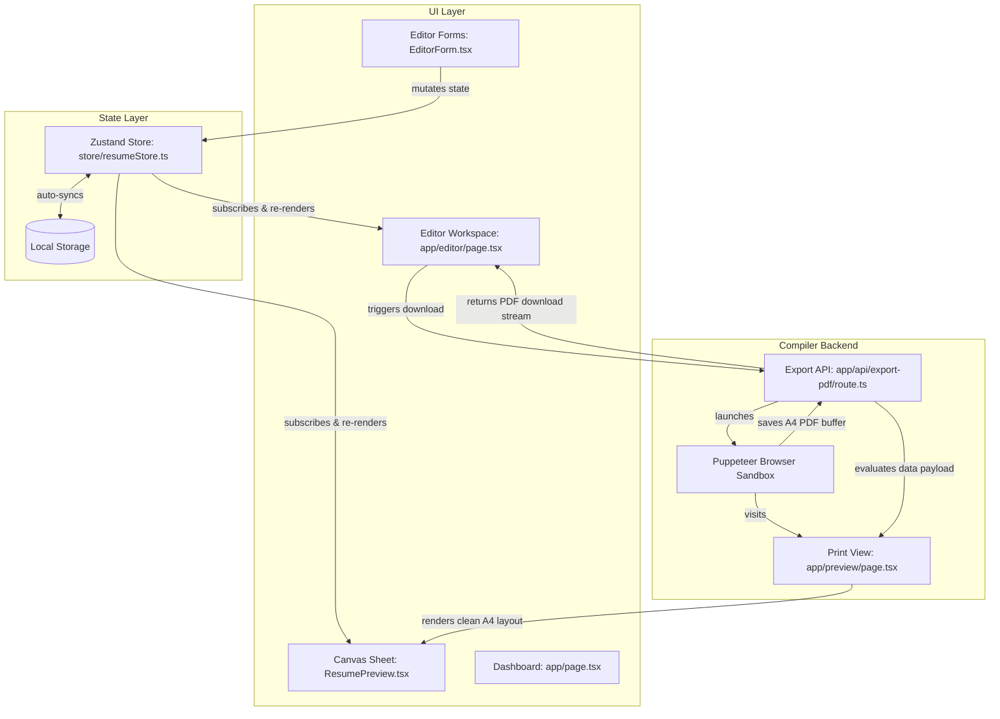
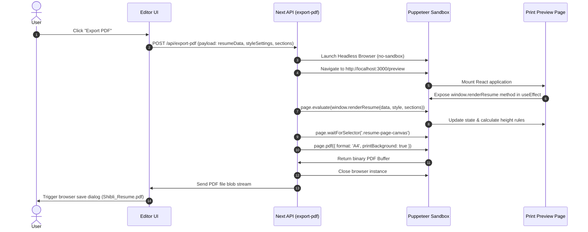

# 🏗️ Architecture Design & Tech Stack

This document details the system layers, architecture, data flows, and layout algorithms utilized in the **AI-Driven Resume & Cover Letter Builder**.

---

## 🛠️ The Tech Stack

| Layer | Technology | Role |
| :--- | :--- | :--- |
| **Frontend Core** | Next.js 15 (App Router), React 19, TypeScript | Page routing, client-side rendering, layout boundaries |
| **UI Components** | Ant Design (AntD v5), Lucide Icons | Form fields, modals, sliders, tabs, toggles |
| **Styling System** | Vanilla CSS + CSS Variables, TailwindCSS | CSS variables allow direct DOM modifications during auto-fitting |
| **State Layer** | Zustand + Immer + Persist | Global state tree with localStorage sync & automatic migrations |
| **Print Backend** | Headless Puppeteer (headless Chrome) | Compiles custom pixel-perfect A4 pages to standard PDFs |
| **Orchestration** | Docker, Docker Compose | Installs Chrome binaries, provisions environment, builds routes |

---

## 📦 Architectural Layers



---

## 🔄 Sequence Flows

### 1. The PDF Export Cycle
When exporting the resume, Puppeteer loads a serverless browser and connects to a clean `/preview` route. Since localStorage is inaccessible in headless browsers, we use a custom evaluate callback to inject the layout state directly into the browser tab's global context:



---

## ⚡ Key Layout Algorithms

### 1. Single-Page A4 Budgeting (Auto-Fit)
The core layout engine in `ResumePreview.tsx` contains an iterative budget loop that matches content bounds to standard A4 printing constraints. 

```
┌──────────────────────────────────────────────────────────┐
│              Calculate el.scrollHeight                   │
├─────────────────────────────────────────────┬────────────┤
│   Height <= 1122px (Fits 1 page)            │ Yes (Exit) │
├─────────────────────────────────────────────┼────────────┤
│   Is autoFit active?                        │ No (Exit)  │
├─────────────────────────────────────────────┴────────────┤
│   Loop steps 1 to 10:                                    │
│   - decrease font-size   (by 0.35px)                     │
│   - decrease margins     (by 1.2px)                      │
│   - decrease line-height (by 0.015)                      │
│   - decrease row gaps    (by 0.6px)                      │
│   Apply CSS Variables on canvas element                  │
│                                                          │
│   Does scrollHeight <= 1122px?              │ Yes (Break)│
└─────────────────────────────────────────────┴────────────┘
```

### 2. Canvas HTML5 Drag-and-Drop
The canvas handles vertical and cross-column reordering natively:
*   Standard HTML5 elements are wrapped in `draggable={isEditable}`.
*   Moving sections sets local component coordinates and tracks drag-over dropzones.
*   Dropping dispatch updates coordinates using `reorderSections(draggedId, targetId, column)` which shifts indexes inside Zustand.
