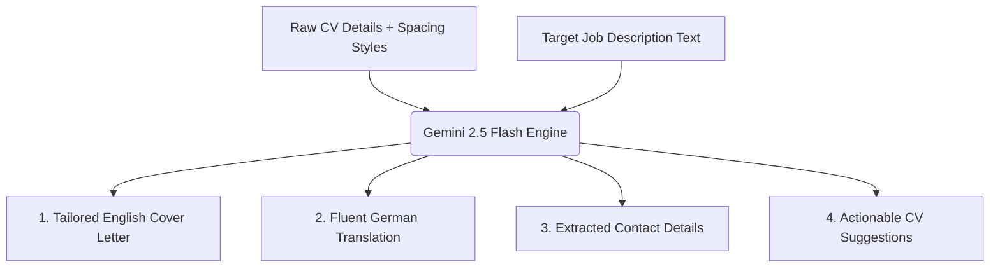

# 🧳 ResuLocal

> **ResuLocal** is a free, privacy-focused, local-first AI Resume & Cover Letter Builder. It runs entirely on your local machine and uses an intelligent **Single-Page A4 Budgeting Engine** that automatically fits content into an exact page boundary.

**NO SUBSCRIPTIONS**, **NO CLOUD TRACKERS**, and **NO PAYWALLS**. All resume data is kept **COMPLETELY PRIVATE** inside your browser's local database. Built with ❤️ by **AHMAD RAZA SHIBLI**.

---

## ✨ Features at a Glance

### 1. 🎛️ Live Canvas Drag-and-Drop
*   Directly grab, drag, and reorder sections (Education, Work Experience, Skills, Projects, etc.) between the left and right columns on the live preview canvas.
*   The layouts snap and re-arrange reactively to balance columns.

### 2. 🤖 AI Co-Pilot & ATS Audit (Gemini 2.5 Flash)
*   **ATS Keyword Optimizer:** Cross-references your CV against target job listings to flag missing skills, content gaps, and formatting inconsistencies.
*   **Contact Info Extractor:** Automatically pulls out the company name, contact email, and the person responsible from job descriptions.
*   **English/German Cover Letter Writer:** Drafts tailored cover letters in English, with a quick toggle button to view and copy a professional German translation instantly.

### 3. 📄 A4 Auto-Fit Budgeting Engine
*   **1-Page Constraint:** Toggle **Auto-Fit** to trigger an iterative layout budgeting loop. The engine dynamically scales font sizes, row gaps, page margins, and line heights in real-time until your CV fits exactly on a single page.
*   **Custom Color Pickers:** Independently configure your primary **Theme Color** and your **Dates/Location Metadata Color** to establish clear visual hierarchy.

### 4. 🔗 Clickable PDF Links
*   Add custom URL endpoints with custom display labels (e.g. `github.com/shibli`) for Email, GitHub, LinkedIn, and websites.
*   Exported PDF files retain full clickable anchor redirects.

### 5. 📦 Self-Hosted & Offline-Capable
*   Runs inside a lightweight Docker container.
*   Bundles a headless Chromium instance to generate clean, print-perfect PDFs without raw browser margins, headers, or footers.

---

## 📸 Visual Walkthrough & System Mechanics

### 1. The Portfolio Dashboard
Manage and coordinate multiple portfolios. Blueprints can be duplicated, customized, and edited independently.


### 2. The Workspace Editor & Canvas Preview
An all-in-one editing interface. Build your sections on the left-hand form inputs and watch the A4 single-page sheet preview adjust on the right-hand side. Here you can apply layout templates, tune metadata colors, drag sections to reorder, or toggle the real-time auto-fit engine.


### 3. Central Content Snippet Library
Save bullet point and profile summary variations. This helps you quickly swap achievements depending on the target role you are applying to.

#### Bullet Points Snippets


#### Profile Summaries Snippets


#### Skills & Technologies Lists


---

## 🤖 How the AI Generation Engine Works

The co-pilot parses and compiles job-specific documents using a multi-phase semantic alignment flow:



1.  **Job Analysis:** The user enters the target job listing description.
2.  **Context Synthesis:** The server endpoints ingest your **current CV details** (experiences, achievements, skills) alongside the job text, passing them directly to the **Google Gemini 2.5 Flash model**.
3.  **Structured Outputs:** The AI dynamically extracts the recruiter's contact details (Email, Company, Responsible Person), drafts a matching metrics-focused cover letter in English, translates it to German, and suggests updates (missing keywords or frameworks) to add to your CV to increase your selection probability.
4.  **Dynamic Rescans:** If you update your CV based on the recommendations, you can click generate again. The latest state is submitted, outputting a refreshed letter matching your new achievements.

---

## 🔑 Configuring the Gemini AI API Key

To enable the cover letter generator, metadata extraction, and ATS scanning:

1. Obtain a free API key from [Google AI Studio](https://aistudio.google.com/).
2. Create a file named `.env` in the project root.
3. Write your key:
   ```env
   GEMINI_API_KEY=your_actual_gemini_api_key_here
   ```

---

## 🚀 How to Run the App

### Option A: Using Docker (Recommended)
Docker automatically configures Puppeteer and Chromium dependencies for PDF generation:

1.  Make sure you have Docker and Docker Compose installed.
2.  Launch the container stack:
    ```bash
    docker-compose up --build
    ```
3.  Open [http://localhost:3000](http://localhost:3000) in your browser.

### Option B: Using Node.js locally
1.  Install packages:
    ```bash
    npm install
    ```
2.  Start the Next.js dev server:
    ```bash
    npm run dev
    ```
3.  Open [http://localhost:3000](http://localhost:3000) in your browser.

---

## 🛠️ Step-by-Step User Guide

### 1. Creating and Swapping Resume Copies
*   On the dashboard page, click **Create New Resume** or edit the seeded template.
*   You can clone resumes, rename them, or delete custom profiles. Each resume has isolated style settings and custom section lists.

### 2. Tuning Layout Presets
*   Select between **Template 1**, **Template 2**, or **Template 3** directly above the canvas preview to instantly swap section hierarchies (e.g. left vs right column distribution).
*   Add **Custom Sections** dynamically and style them as timeline lists, tag clouds (for skills/interests), or text blocks.

### 3. Using the Snippet Content Library
*   Click the bookmark icon next to any work experience highlight or summary input to save it.
*   Open the **Content Library** tab to insert saved bullet points or summary variations to quickly adapt your CV for different job openings.

---

## 🏗️ Technical Architecture
For detailed information regarding state mutations (Zustand + Immer), database hydration, and Puppeteer PDF printing sequences, check out [ARCHITECTURE.md](file:///c:/Users/91790/Documents/Germany/Job/resumeBuilder/ARCHITECTURE.md).
